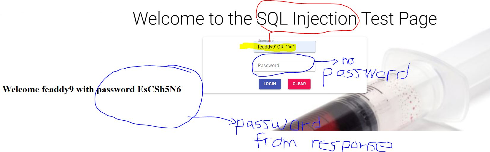

## Fibonnacci using Memoization
I am working from home so I started aroung 1100.  
Thanks to the walkthrough, once again from Jose Portilla's Python Bootcamp, I was going through the Fibonacci sequence utilizing memoization. He applied a set cache was also the value of the nth value in the series. His cache started with an array of Nones.  

```
n = 3
cache = [None] * (n + 1)


def fib_dyn(n):
    
    # Base Case
    if n == 0 or n == 1:
        return n
    
    # Check cache
    if cache[n] != None:
        return cache[n]
    
    # Keep setting cache
    cache[n] = fib_dyn(n-1) + fib_dyn(n-2)
    print("first:" + str(fib_dyn(n-1)))
    print("second: " +str(fib_dyn(n-2)))
    print(cache)
    return cache[n]

print("Results: " + str(fib_dyn(n)))

```
I did annotate a couple of print statements to see, once again, on how the recursive case flew. On this casem because the recursive calls were being cached, it seemed like they were being called on after the other not like the pure recursive example. I only schedule an hour.....I'll probably do two hours to understand the insights on why the code was they way it was coded. I'd rather take my time whiteboarding the problem so I can fully understand the data flow.  

# MVP for my SQL Injection Page
I was very surprised with my progress regarding this project. I finally was able acheive MVP for my project.  
But I gotta tell, I'm gonna neet a lot of refactoring to make my code look more organized.  
First, I was trying to make sure that my Spring application was handling the authentication portion.  
And, yes, I am security professional but I intentionally made this website insecure for simple SQL injections.  

```
@PostMapping("/user")
    @ResponseBody
    public User authenticateUser(@RequestBody User user) {

        var users = (List<User>) userService.findAll();

        var validatedUser = new User();

        users.forEach((item) -> {
            if (item.getUsername().equals(user.getUsername()) && item.getPassword().equals(user.getPassword())) {
                validatedUser.setUsername(user.getUsername());
                validatedUser.setPassword(user.getPassword());
            }
        });

     return validatedUser;
    }
```

Also, I am kinda proud of the method I coded, of course with the help of mighty google, for my repository.

```
@Repository
public interface UserRepository extends CrudRepository<User, Long>{
    @Query("SELECT u FROM User u WHERE u.username = :username and u.password = :password")
    User findUserByUsernameAndPassword(
            @Param("username") String username,
            @Param("password") String password
    );
}
```
Well, the previous code did NOT help my goal of making my application vulnerable.  
Another shoutout to Chad Darby from luv2code. I utilized his tutorial to come up with my vulnerable endpoint.  
Basically, I still left the original code that I had but I assigned a seperate method / endpoint for the vulnearable code and guess what......IT WORKED!

```
 @PostMapping("/inject")
    @ResponseBody
    public User sqlInject(@RequestBody User user) {
        var validatedUser = new User();
        try {
            // 1. Get a connection to database
            String url = "jdbc:postgresql://localhost:5432/sample?user=*************&password=***********";

            Connection myConn = DriverManager.getConnection(url);
            // 2. create a statement
            Statement myStmt = myConn.createStatement();

            String username = user.getUsername();
            String pwd = user.getPassword();

            // 3. Execute SQL query
            ResultSet myRs = myStmt.executeQuery("SELECT * FROM sample WHERE username = '"
                    + username + "' AND password = '" + pwd + "'");

            // 4. Process the result set
            while (myRs.next()) {
                validatedUser.setUsername(myRs.getString("username"));
                validatedUser.setPassword(myRs.getString("password"));
            }
        } catch (Exception e) {
            e.printStackTrace();
        }
        return validatedUser;
    }
```
THe code above was my golden ticket to my MVP.

<p align="center">
  
</p>

I inserted valid user and the 1 = 1 -> ```feaddy9' OR '1'='1``` and feaddy9 was a valid user.  
As you can see that the password field was blank but I was able to retrieve the password due to the response from my application. 

### Tasks for tomorrow......17 Feb
- Refactor the heck out of my applicaiton espcially my frontend.....that Helper file needs some help
- Try to solve the next problem using recursion and then walkthrough with the whiteboard
- Make front page more decent looking 

