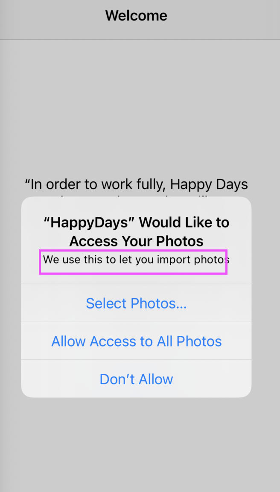
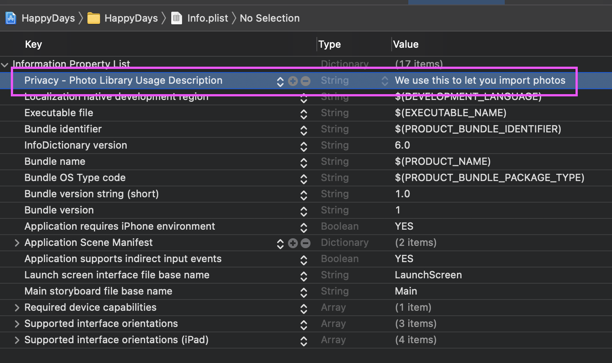

# Happy Day IOS app via Advanced IOS Volume 1

##### Initial View Controller: Navigation Controller in which the Happy Days CollectionView is embedded in

<p align="center">
  
</p>

##### But....inside viewDidAppear is the checkPermissions() function
```
 override func viewDidAppear(_ animated: Bool) {
        super.viewDidAppear(animated)
        checkPermissions()
    }
```
and by default..... ```let photosAuthorized = PHPhotoLibrary.authorizationStatus() == .authorized``` is ```false```

```
func checkPermissions() {
        // check status for all three permissions
        let photosAuthorized = PHPhotoLibrary.authorizationStatus()
            == .authorized      
        
        if photosAuthorized == false {          
            if let vc = storyboard?.instantiateViewController(withIdentifier: "FirstRun") {
                navigationController?.present(vc, animated: true)               
            }
        }
    }
```
the vc will show the ViewController that has the FirstRun identifier


<p align="center">
  
</p>

```
 @IBAction func requestPermission(_ sender: Any) {
        requestPhotosPermissions()
    }
    .....
    
// I am pretty proud of the code below utilizing the requestAuthorization 
    func requestPhotosPermissions() {
        
        PHPhotoLibrary.requestAuthorization { (PHAuthorizationStatus) in
            DispatchQueue.main.async {
                if PHAuthorizationStatus == .authorized {
                    self.authorizationComplete()
                } else {
                    self.PermissionLabel.text = "Create a button to re-enable my app to ask for permissions again"
                }
            }
        }
    }
```
if ALLOW ACCESS TO ALL PHOTOS is selected = ```PHAuthorizationStatus == .authorized```   
NOTE: I am showing changing configurations on info.plist  


<p align="center">
  
  
</p>

dismisses the VC that was presented modally....GO to CollectionViewController

```
    func authorizationComplete() {
        dismiss(animated: true)
    }
```
