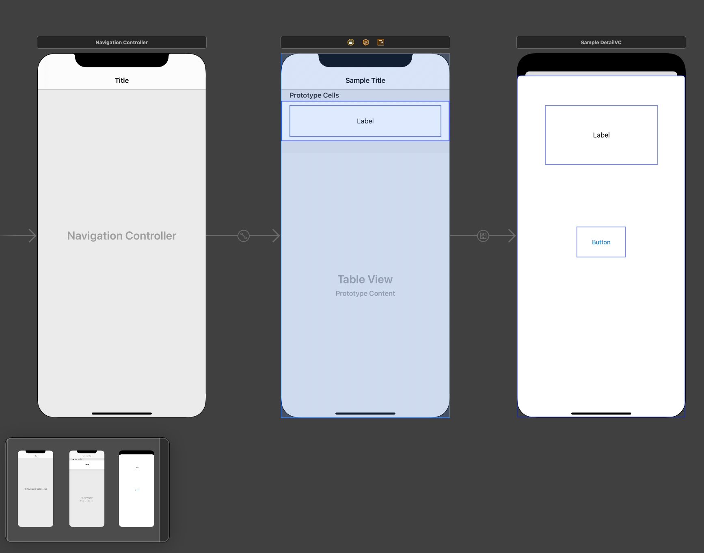

# UITableView with Searching capability

### Shout: Thanks to https://www.raywenderlich.com/4363809-uisearchcontroller-tutorial-getting-started#toc-anchor-001

## Main Interface 
<p align="center">
  
</p>

##### The application has threes cells with entries from the struct uith a function that generates sample data

### Struct Definition
```
import Foundation

struct SampleData {
    var sample: String
    var details: String
    
    func generateData() -> [SampleData] {
        [SampleData(sample: "Sample1", details: "This is sample one"),
         SampleData(sample: "Sample2", details: "This is sample two"),
         SampleData(sample: "Sample3", details: "This is sample three")
        ]
    }
}
```
##### ```func generateData()``` is used for geneerating the data 

## StoryBoard Configuration
<p align="center">
  
</p>

- TableViewController embedded in Navigation Controller
- Navigation Controller is the Initial Controlller
- Inserted label in TableViewCell and details VC
- Added a button to dismiss the current view => details VC
- TableViewController has a custom class => SampleTableViewController
- TableViewCell has a custom class => SampleTableViewCell => NOTE: I don't even know I need it
- Details VC had a custom class => SampleDetailVC
- Segue Identifier from the tableView to details VC => showDetail

## TableView to Detail VC
```
class SampleTableViewController: UITableViewController {

  var sampleData = SampleData(sample: "", details: "")
  
  override func numberOfSections(in tableView: UITableView) -> Int {
        return 1
    }
  
  override func tableView(_ tableView: UITableView, numberOfRowsInSection section: Int) -> Int {
        if isFiltering {
            return filteredSample.count
          }
        return sampleData.generateData().count
    }
  
  
  override func tableView(_ tableView: UITableView, cellForRowAt indexPath: IndexPath) -> UITableViewCell {
    
        guard let cell = tableView.dequeueReusableCell(withIdentifier: "sampleCell", for: indexPath) as? SampleTableViewCell else {
            fatalError("The dequeued cell is not an instance of SampleTableViewCell.")
        }
        
        let info: SampleData
        
        if isFiltering {
            info = filteredSample[indexPath.row]
        } else {
            info = sampleData.generateData()[indexPath.row]
        }
          
        cell.sampleLabel.text = info.sample
        
        return cell
    }
    
    override func prepare(for segue: UIStoryboardSegue, sender: Any?) {

        if let row = tableView.indexPathForSelectedRow?.row {
            let item = sampleData.generateData()[row]
            let sampleDetailVC = segue.destination as! SampleDetailVC

            sampleDetailVC.detailData = item.details
        }
    }
}
```
- numberOfSections, numberOfRowsInSection, cellForRowAt are required instance methods for a tableview
- prepare instance method was used so I can transition to details VC

### Emphasis on the segue
```
  override func prepare(for segue: UIStoryboardSegue, sender: Any?) {

        if let row = tableView.indexPathForSelectedRow?.row {
            let item = sampleData.generateData()[row]
            let sampleDetailVC = segue.destination as! SampleDetailVC

            sampleDetailVC.detailData = item.details
        }
    }
```
- It looks like did not utilize the segue identifier
- This will be my template moving forward when it comes to segue

### Details VC

```
class SampleDetailVC: UIViewController {  
    var detailData: String!
    
    @IBOutlet var buttonLabel: UIButton!
    
    @IBOutlet var detailLabel: UILabel!

    @IBAction func closeVC(_ sender: Any) {
        dismiss(animated: true, completion: nil)
        
    }
    
    override func viewDidLoad() {
        super.viewDidLoad()
        
        detailLabel.text = detailData
        buttonLabel.setTitle("Close", for: .normal)
    }
}
```
- detailData reeived data from SampleTableViewController
- ```buttonLabel.setTitle("Close", for: .normal) ``` programmatically changed the title of button
-  ```detailLabel.text = detailData``` displayed the detail data

## The searching
```
  let searchController = UISearchController(searchResultsController: nil)
  var filteredSample: [SampleData] = []
    
    var isSearchBarEmpty: Bool {
      return searchController.searchBar.text?.isEmpty ?? true
    }
    
    var isFiltering: Bool {
      return searchController.isActive && !isSearchBarEmpty
    }
 ```
 - By initializing UISearchController with a nil value for searchResultsController, you’re telling the search controller that you want to use the same view you’re searching to display the results.
 - isSearchBarEmpty returns true if the text typed in the search bar is empty; otherwise, it returns false
 - computed property to determine if you are currently filtering results or not => ```isFiltering```
 
