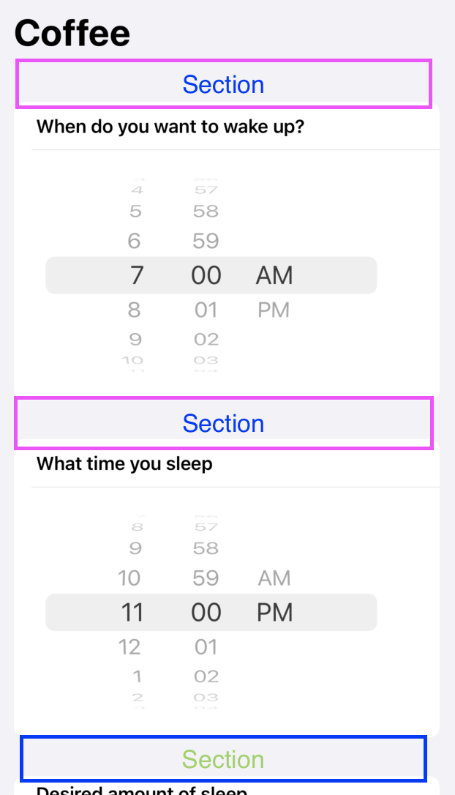
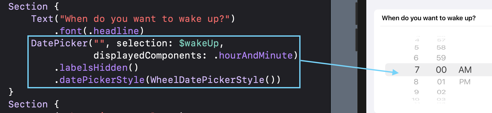
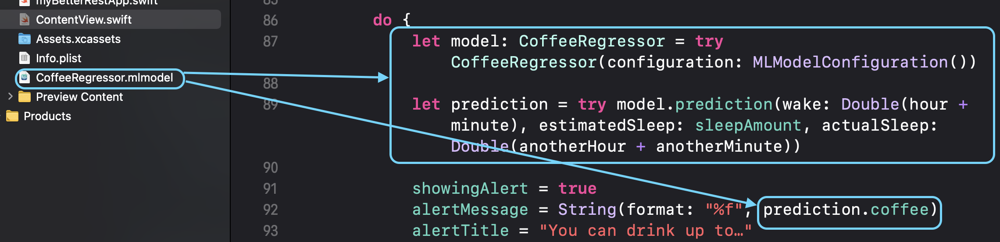

# My Not So Good App 

Reference: https://www.hackingwithswift.com/books/ios-swiftui/betterrest-introduction

First of all, thanks to Paul Hudson aka @twostraws for the walkthrough. 
I basically utilized the tutorial and turned it into my own but unfortunately wasn't too good.
I am trying to understand Machine learning utilizing Tabular data

<p align="center">
  
</p>


### Static Declaration, Date Component, and Calendar 

```
static var defaultWakeTime: Date {
        var components = DateComponents()
        components.hour = 7
        components.minute = 0
        return Calendar.current.date(from: components) ?? Date()
    }
```
- Static declaration allows other variables to access the static variables upon declaration 
- ```DateComponents()``` allows you to decompose the date object
- Calendar object returns a default date based on components

### NavigationView declared for bar items like the title and button
```
NavigationView {

  // code....

}.navigationBarTitle("Coffee")
            // run the method is tapped
            // it won't return anything
            .navigationBarItems(trailing:
                                    Button(action: calculateBedtime) {
                                        Text("Calculate")
                                    }.alert(isPresented: $showingAlert) {
                                        Alert(title: Text(alertTitle), message: Text(alertMessage),
                                              dismissButton: .default(Text("OK")))
                                    })
        }
```
- The purpose of the NavigationView was utilized to implement a title and button at the very top of the view

### Sections within Form
<p align="center">
  
</p>

```
NavigationView{
  Form {
    Section {
      .......
    }
    Section {
      .......
    }
    Section {
      .......
    }
  }
}
```
- Forms that have sections are spaced out

### DatePicker with ```.datePickerStyle(WheelDatePickerStyle())```
<p align="center">
  
</p>

```
Section {
    Text("When do you want to wake up?")
        .font(.headline)
    DatePicker("", selection: $wakeUp,
               displayedComponents: .hourAndMinute)
        .labelsHidden()
        .datePickerStyle(WheelDatePickerStyle())
}
```
- I personally like the ```.datePickerStyle(WheelDatePickerStyle())```

### Alert Notification
<p align="center">
  
</p>

```
.navigationBarItems(trailing:
    Button(action: calculateBedtime) {
        Text("Calculate")
    }.alert(isPresented: $showingAlert) {
        Alert(title: Text(alertTitle), message: Text(alertMessage),
              dismissButton: .default(Text("OK")))
    })
```
- Utilizing alert with state declaration to manage on when the alert message appears

### Prediction, features and target when creating a Machine Learning Project
<p align="center">
  
</p>

- The CoffeeRegressor Model Class was created from a csv file  
- The wake time, estimated sleep time length and sleeptime are the inputs and the target is the number of coffee drinks

### Prediction gone wrong
<p align="center">
  
</p>
- The project was a tutorial but I tried to put a little spin on it but...the predictions were way off

